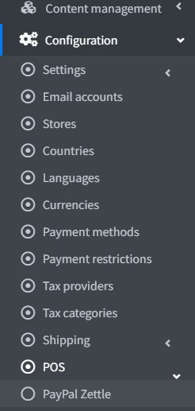
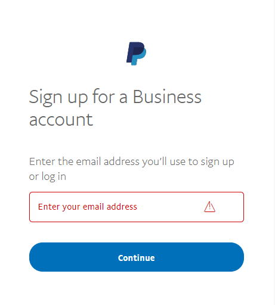
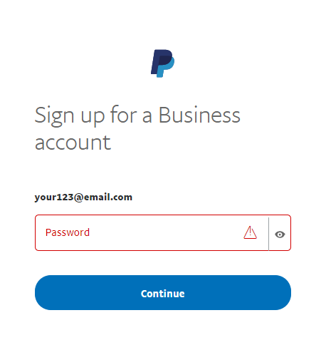
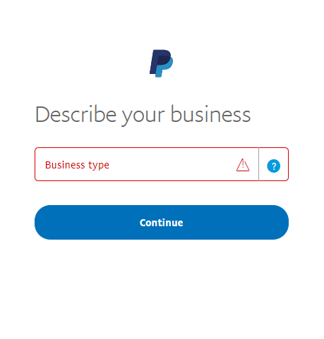
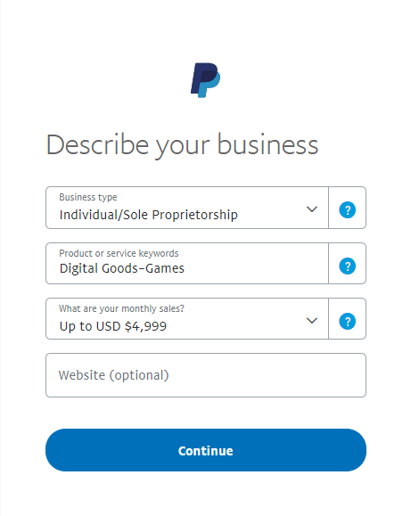

# PayPal Zettle

*PayPal Zettle* is the complete point of sale solution (POS) that gives you the power to accept card, contactless, and mobile payments. And it easily syncs with your nopCommerce store, helping you do business where you sell today and plan to sell tomorrow, whether online, in-store, or on-the-go. Use your PayPal details to sign up and link your accounts in minutes, so your earnings can be added directly into your PayPal account.

## Configure the POS method

To configure the `PayPal Zettle` plugin, go to **Configuration → POS**. Then find the **PayPal Zettle** POS solution:

Follow these steps to configure `PayPal Zettle`.

1. Create a PayPal Business account

   If you already have a PayPal account, just proceed to the next section.

   If you don't then register a Business account following these instructions. Then download the PayPal Zettle POS app, and order your card reader.

   

    > [!NOTE]
    >
    > If you already have an account, you will be redirected to the authorization.

    

    

    

    

1. Configure the PayPal Zettle plugin

    Open the PayPal Zettle configuration page in the admin area. You will see the following form:

   

1. Go to your **merchant account**.  
    

    Review the information and click **Create key**. A client ID will be created together with the API key.

    

    On the **Create API key page**, click **Copy key** and paste it into the field on this plugin configuration page, do the same for **Client ID**.

    

    > [!NOTE]
    >
    > The API key will be displayed only once, so make sure to make a copy of it.

    Click **Save** to save the plugin settings.

    After entering, information about the current connection status will be displayed, a disconnect button, some profile details. If any errors occur during connection or inconsistencies between store settings and *Zettle* profile, warnings will be shown. For the correct operation of the plugin we should correct them.

    

1. Product Library Synchronization

    Product Library Synchronization is the main feature of the plugin. Synchronization is configured on the same page in a separate panel. We don’t have separation between Initial Synchronization and Updates. Everything is configured and launched in one place, it doesn't matter if this is initial synchronization or next regular updates.

    

    > [!TIP]
    >
    > We have full instructions here how to make the synchronization and each point has a prompt.

    The source of truth is the nopCommerce store so sinchronization of the products is one-sided - from the nopCommerce store to the Zettle catalog. Herewith we can choose whether to delete the products in the catalog or leave them.

    Synchronization can be automatic (scheduled task) or manually started by the merchant from this page. For automatic, we have to **Enable auto synchronization** and set the **Auto synchronization period**.

    Before synchronization, we need to choose which products we want to import into the *Zettle* catalog. For this, there is a spreadsheet below the settings.

    

    Only those products will be synchronized that are included in this spreadsheet. In the future, with any changes to the product (updating details, deletion, image change, etc.) these changes will be synchronized with the catalog. Synchronization of a specific product can be paused (property **Active**).

    > [!NOTE]
    >
    > Settings **Sync enabled** (same as **Active**), **Price sync enabled**, **Image sync enabled**, **Inventory tracking enabled** are applied when adding a product to the table, so these are settings by default. They can also be set for each specific product.

    During synchronization, either the product itself will be imported or its product attribute combinations if they are indicated.

    Also we could add existing discounts when synchronizing.

1. Inventory Synchronization

    The second feature of the plugin is **Inventory Synchronization**. This synchronization works in both side, and for changes in the store (nopCommerce) and changes in the catalog (Zettle).

    In order to track inventory for a product, we need to enable **Inventory tracking enabled**. On the next sync, tracking will be enabled and the changes will start syncing. If we no longer need tracking for a product, we must disable this option accordingly.

Now we should save the synchronization settings and **start** it.

> [!TIP]
>
> You can find out the details of the synchronization process in the log.
> 

## Limit to stores and customer roles

You can limit any payment method to store and customer role. This means that the method will be available to certain stores or customer roles only. You can do this from the *plugin list* page.

1. Go to **Configuration → Local plugins**. Find the plugin you want to limit. In our case, it's **PayPal Zettle**. To find it faster, use the *Search* panel in the top of the page and search by **Plugin name** or **Group** using the *Payment methods* option.

    

1. Click the **Edit** button, and the *Edit plugin details* window will be displayed as follows:

    

1. You can set up the following limits:

    * In the **Limited to customer roles** field, choose one or several customer roles, that is, administrators, vendors, guests, who will be able to use this plugin. If you don't need this option just leave this field empty.

        > [!Important]
        > In order to use this functionality, you have to disable the following setting: **Catalog settings → Ignore ACL rules (sitewide)**. Read more about the access control list [here](xref:en/running-your-store/customer-management/access-control-list).

    * Use the **Limited to stores** option to limit this plugin to a certain store. If you have multiple stores, choose one or several from the list. If you don't use this option, just leave this field empty.

        > [!Important]
        > In order to use this functionality, you have to disable the following setting: **Catalog settings → Ignore "limit per store" rules (sitewide)**. Read more about multi-store functionality [here](xref:en/getting-started/advanced-configuration/multi-store).

    Click **Save**.
