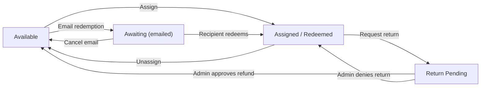

# Assigning and Transferring NexPort Campus Seats

This guide covers assigning seats from organization purchases to learners, unassigning when appropriate, and transferring a seat from one learner to another.

## Overview

* Seats come from organization purchases managed by purchasing agents or admins.
* A seat becomes an enrollment in NexPort Campus when redeemed (auto or manual).
* Assign seats directly, or email redemption links so learners self‑redeem.

## Where to manage seats

* Customer portal: My Account → Orders (for purchasing agents)
* Admin: Sales → Orders → open order → seat/redemption actions

## Assign a seat

1. Open the order and locate the unassigned seat/redemption.
2. Choose Assign, select the learner, and confirm.
3. If supplemental questions are configured, provide required data.
4. Enrollment is created (or queued if manual approval is required).

## Transfer a seat (unassign then reassign)

* Unassign the current learner to return the seat to available, then Assign to a new learner.
* If a redemption is in Awaiting status (emailed link not redeemed), you can cancel it to reclaim the seat before assigning elsewhere.

## Constraints and options

* Delete Finished behavior: If the learner has an In Progress enrollment, “Delete Finished” cannot be used; resolve the existing enrollment first.
* Manual vs Auto‑redeem: Auto creates the enrollment after payment; manual requires clicking Redeem or using Assign.
* Owner group: Seats can be tied to a Purchasing Group (Owner Group) for tracking and permissions.

## Statuses you’ll see

* Available: Seat is unassigned.
* Awaiting: Emailed redemption sent; not yet redeemed by the recipient.
* Assigned/Redeemed: Enrollment created in NexPort Campus.
* Returned: Seat was returned via a return/refund flow.

## Troubleshooting

* Can’t unassign because a prior unassignment request exists: resolve the previous request first.
* Training link not visible for a learner: ensure the seat is assigned/redeemed; links only appear after assignment.
* Assign fails with Delete Finished: learner already has an active enrollment; address the existing one first.

## Related

* [Returns and Refunds for Seats (admin)](../returns-and-refunds-for-seats.md)
* [Email Redemption Links for Seats (admin)](../email-redemption-links-for-seats.md)
* [Purchasing Groups (admin)](../purchasing-groups.md)
* [Orders & Fulfillment (admin)](../orders.md)
* [NexPort Mapping (admin)](../nexport-mapping.md)

## Status flow (Admin)

