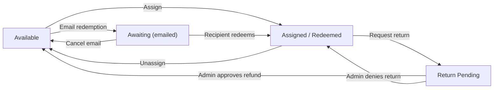

# Managing Seats as a Purchasing Agent

This page explains how to assign, unassign, and distribute seats via email from your orders.

## Where to manage seats
- Go to My Account → Orders, open the relevant order, then use seat actions.

## Actions
- Assign: Select a learner to receive the seat immediately.
- Email redemption: Send a link so the recipient can redeem the seat.
- Unassign/Transfer: Unassign to make the seat available, then assign to someone else.
- Request return (if allowed): Ask an admin to return and refund a seat.

## Status flow (Store / Purchasing Agent)

## Tips
- If a learner already has an active enrollment, you may need admin help before reassigning.
- If an emailed link won’t be used, cancel it to reclaim the seat.
- Training links only appear after the seat is assigned/redeemed.

## Related
- Assigning and Transferring NexPort Campus Seats (admin): ../admin-guide/assigning-and-transferring-seats/README.md
- Email Redemption Links for Seats (admin): ../admin-guide/email-redemption-links-for-seats.md
- Returns and Refunds for Seats (admin): ../admin-guide/returns-and-refunds-for-seats.md
